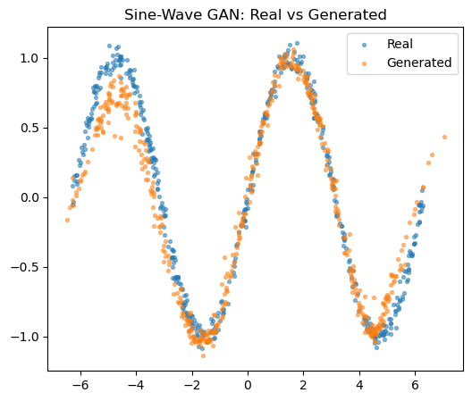
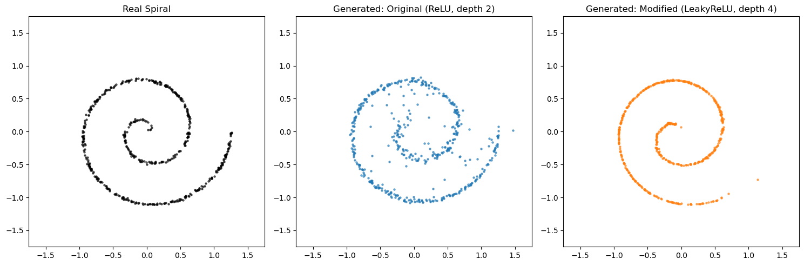
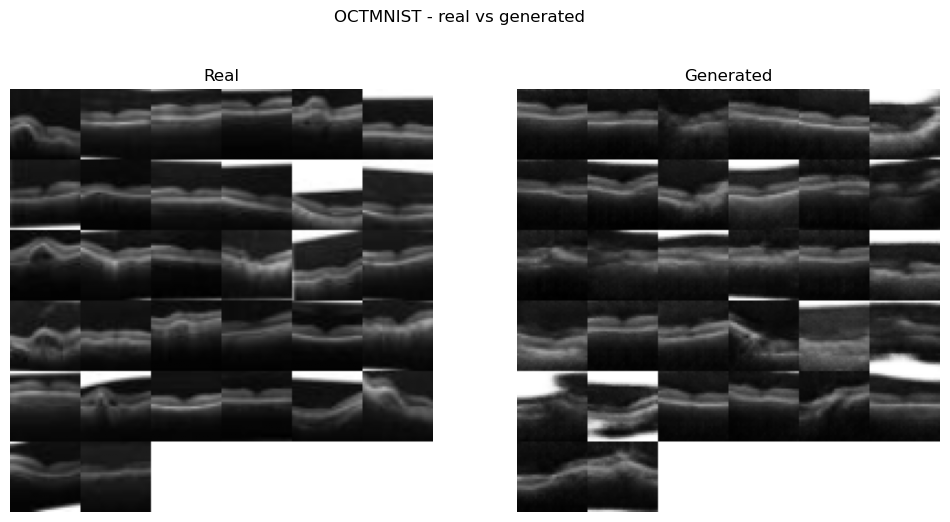
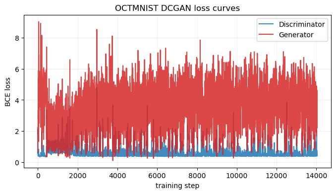
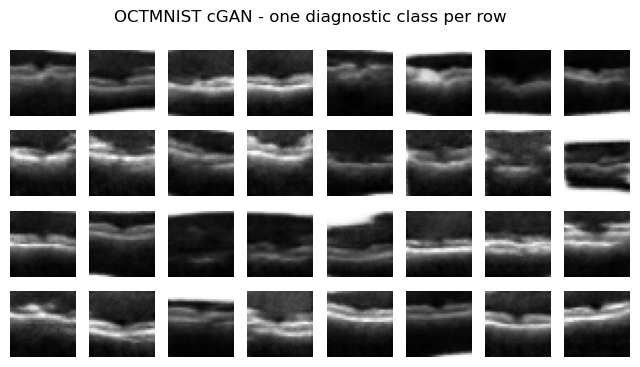
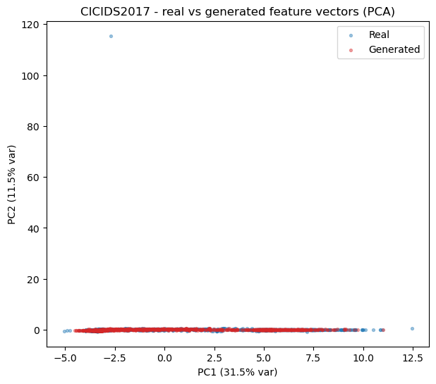
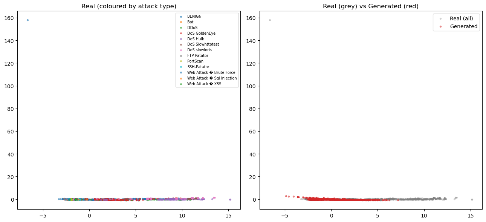
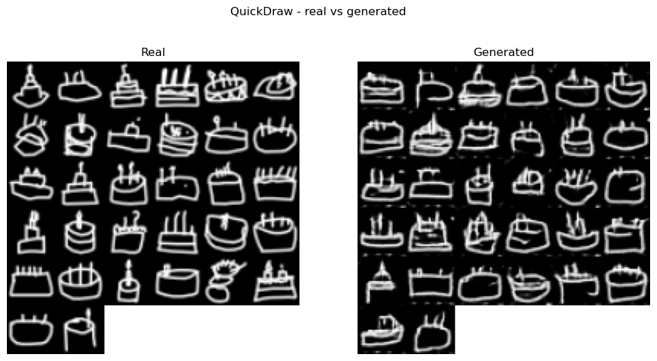
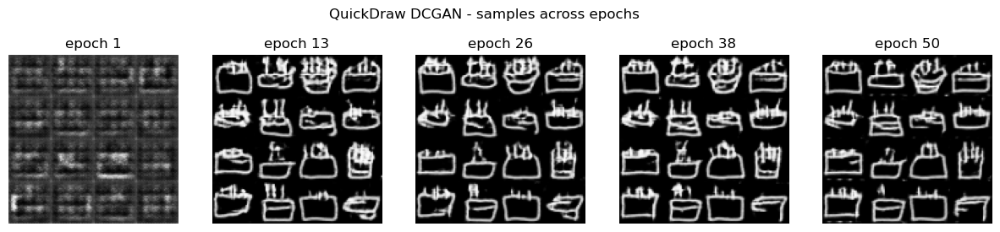
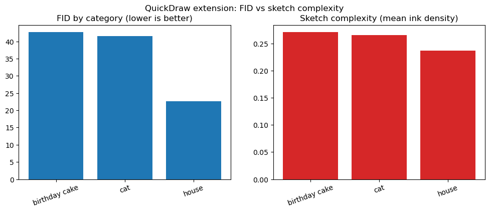

# Generative Adversarial Networks: From 2D Toy Data to Real-World Applications

## 1. Introduction

A Generative Adversarial Network (GAN) trains two networks in opposition: a *generator* that maps random noise to samples, and a *discriminator* that tries to separate real data from generated data. As the discriminator improves at spotting fakes, the generator is forced to produce more convincing samples, and at the ideal equilibrium the discriminator does no better than chance (Goodfellow et al., 2014). This report applies that idea in two stages. Part 1 builds a GAN from scratch in PyTorch and fits it to synthetic 2D data, where learning behaviour is visible on a scatter plot. Part 2 applies GANs to three real-world problems: generating OCT retinal scans (medicine), synthesising network-flow records (cybersecurity), and drawing doodles (creative arts). The focus throughout is on *why* each architecture suits its problem and on interpreting what the models actually produce.

---

## 2. Part 1: Building and Understanding GANs from Scratch

All three tasks share a fixed training recipe so comparisons stay controlled: BatchNorm (Ioffe and Szegedy, 2015) in the generator, Adam (Kingma and Ba, 2015) with `betas=(0.5, 0.999)`, and one-sided label smoothing with a real target of 0.9 (Salimans et al., 2016). The lower Adam `beta1` damps the oscillation a 0.9 momentum term causes, and label smoothing stops the discriminator becoming over-confident and starving the generator of gradient. The latent dimension is 16 and hidden layers are 64 units wide.

**Task 1 (sine wave).** The baseline reproduces the tutorial: real points from `y = sin(x)` with small noise, a two-layer ReLU generator trained 5,000 epochs against a LeakyReLU discriminator. Losses settle into a stable balance (ending D ≈ 1.36, G ≈ 0.83).

  

***Figure 1.** Sine-wave GAN: real (blue) vs generated (orange) points.* The generated points follow `y = sin(x)` across the full domain, thinning only slightly at the crests, confirming the training loop works before moving to a harder target.

**Task 2 (spiral).** For the new distribution I chose a 2D Archimedean spiral, sampled with a square-root radius so points spread evenly, then scaled to roughly [-1.3, 1.3]. A spiral is awkward because it is a thin, multi-turn manifold that a vanilla GAN tends to collapse into a blob. Trained for 10,000 epochs, the generator recovers both arms and the central curl, with the discriminator staying in the 1.25-1.36 band and the generator in 0.80-0.86 throughout. This only works *because* of the stabilisers, BatchNorm especially.

**Task 3 (architecture change).** I change exactly two things and hold everything else fixed: activation from **ReLU to LeakyReLU(0.2)** and hidden depth from **2 to 4**. LeakyReLU keeps a gradient for negative inputs (fewer dead units) and the extra depth adds capacity to bend a thin curve.

  

***Figure 2.** Real spiral (left) vs original ReLU/depth-2 generator (centre) vs modified LeakyReLU/depth-4 generator (right).* The original scatters stray points off the curve and partly fills the empty centre, while the deeper LeakyReLU model draws a tighter, cleaner spiral. The cost shows in the losses: the modified generator runs higher and noisier (up towards 1.5-1.8, ending G ≈ 1.19) rather than flat around 0.82, the expected signature of a higher-capacity generator working harder rather than of instability.

---

## 3. Part 2.1: OCTMNIST Retinal Images (DCGAN, TensorFlow/Keras)

**Dataset.** OCTMNIST, from MedMNIST v2 (Yang et al., 2023), has 97,477 training scans (28x28 grayscale) across four imbalanced diagnostic classes: *choroidal neovascularization*, *diabetic macular edema*, *drusen*, and *normal*. The shared structure is a bright, curved retinal band over a darker background with faint layering beneath.

**Model and justification.** Because that structure is spatial and local, a DCGAN is the natural choice over a fully-connected GAN (Radford et al., 2016). The generator maps a 100-D latent vector through a dense layer and three `Conv2DTranspose` blocks (BatchNorm + ReLU) to a 32x32 `tanh` image (~1.08M parameters); the discriminator mirrors this with strided `Conv2D`, LeakyReLU and 0.3 dropout, outputting one logit. Training uses Adam (lr = 2e-4, `beta1` = 0.5) with label smoothing on a 30,000-image subset for 60 epochs. Epoch snapshots (1, 16, 30, 45, 60) show random texture at epoch 1, a recognisable band by the middle, and small refinements after.

  
  

***Figure 3.** Left: real vs generated OCT scans. Right: DCGAN loss curves.* The fakes capture the retinal band and vary across the batch (no mode collapse). The loss curves show the discriminator staying low (≈0.4-0.6) while the generator oscillates in the 2-5 range without collapsing, a discriminator that keeps a modest edge but never wins outright, so the generator kept receiving gradient. The measured FID (Heusel et al., 2017) is **79.02** (lower is better), high, and matching the visible blur in which fine sub-layers and speckle are lost. Three factors inflate it beyond raw quality: only 60 epochs on a subset, upscaling 28→32 px, and FID's use of an ImageNet-trained InceptionV3 (Szegedy et al., 2016) that never saw single-channel medical images.

**Reflection ("looks real vs is true").** The discriminator only ever answers "real or fake"; nothing checks that a generated structure is physiologically valid. The generator can therefore invent a bright band or lesion-like patch that never occurred in a real patient, as long as it looks plausible, this is the hazard of treating GAN output as data. A hallucinated region could mimic disease that is absent, or smooth over a real anomaly, so a synthetic scan must never be used diagnostically. The defensible uses are augmentation and teaching, and any model trained on synthetic scans should be validated on a real-only holdout to confirm it has not just learned to spot GAN artefacts.

**Extension: conditional GAN.** The unconditional model cannot be asked for a specific class. A conditional GAN (Mirza and Osindero, 2014) feeds the label into both networks (embedded and concatenated with the latent vector for the generator; embedded as an extra image channel for the discriminator), forcing realism *per class*. Each class is oversampled to balance the data, and the discriminator uses a slower learning rate, a two-time-scale update that stabilises training (Heusel et al., 2017).

  

***Figure 4.** Conditional GAN output, one diagnostic class per row.* Each row is visibly class-consistent, so the model produces a chosen category on demand. Its losses end near D = 0.34, G = 4.90, similar in character to the unconditional run.

---

## 4. Part 2.2: Cybersecurity - CICIDS2017 Synthetic Traffic (Tabular GAN, PyTorch)

**Dataset.** CICIDS2017 (Sharafaldin et al., 2018) spans eight day-files that must be combined. Across all days the data are heavily imbalanced: 2,273,097 BENIGN flows dwarf the largest attacks, DoS Hulk (231,073), PortScan (158,930), DDoS (128,027), down to rarities like Infiltration (36), SQL Injection (21) and Heartbleed (11). The main model focuses on the **Wednesday file**: 692,703 rows, reduced to 691,406 after dropping ±inf/NaN values (e.g. *Flow Bytes/s* with zero duration), over 78 numeric features. Wednesday holds 439,683 BENIGN and 251,723 attack flows; I take a balanced 20,000-per-class subsample (40,000 rows) and z-score the features.

**Model and justification.** With no spatial grid, a DCGAN makes no sense; the right model is an MLP GAN emitting a full 78-D vector at once. The generator is three BatchNorm + LeakyReLU blocks (256 units) with a *linear* output, deliberately not `tanh`, because the features are z-scored rather than bounded to [-1, 1], so a linear head fits them better. The discriminator is a 256-unit LeakyReLU MLP with 0.3 dropout. Training matches the image parts (Adam lr = 2e-4, `BCEWithLogitsLoss`, label smoothing). Over 60 epochs the discriminator loss falls smoothly from 1.3548 to 1.0248 and the generator rises from 0.8257 to 1.3455, a slow, stable separation with no collapse.

  

***Figure 5.** PCA of real (blue) vs generated (red) flow vectors.* In PCA (Jolliffe, 2002), and equally in t-SNE (van der Maaten and Hinton, 2008), the generated cloud sits on the main body of real points but is more concentrated, capturing where most traffic lives without reaching the tails. Quantitatively, the mean absolute error on feature *means* is a good **0.0723** (standardised units) but on *standard deviations* a weaker **0.3179**: the GAN matches average values far better than spread. The worst-aligned features are timing and flag columns, `FIN Flag Count` (mean error 0.326), the `Bwd IAT` family, `Destination Port`, `Fwd IAT Mean`, `URG Flag Count` and `Fwd PSH Flags`. For the near-binary flags the generated std almost vanishes (`URG Flag Count` 0.030, `Fwd PSH Flags` 0.024, versus real ≈0.9-1.0), so the generator pins them to a constant, partial mode collapse on the discrete features.

**Reflection (security).** The hallucination problem bites harder here: a generated flow only has to look like traffic, a far weaker bar than matching a real attack's timing, packet structure and flag sequences. Used to augment an IDS, a fabricated "attack" matching no real signature could teach the model to miss genuine attacks, while a fabricated "benign" flow drifting attack-ward could raise false positives. Unlike the OCT case there is no visual sanity check for 78 numbers, so the burden falls on quantitative checks that, as the flag collapse shows, can look fine while hiding a behavioural failure. One clarification: the Wednesday file contains **DoS** variants, not DDoS, despite the brief's wording; genuine DDoS is in the Friday file, used below.

  

***Figure 6.** All-days PCA coloured by attack type (left) and real-vs-generated (right).* Combining all eight days (with per-file capping) gives 125,310 rows over every attack family. The generator covers the dense centre (BENIGN, DoS Hulk, true DDoS) but under-represents the smaller clusters. Tellingly, adding diversity made alignment **worse**: mean |mean error| rose 0.0723 → **0.1300** and mean |std error| 0.3179 → **0.4670**, now dominated by the timing family (`Flow Duration`, `Fwd IAT Total`, `Idle`/`Flow IAT` statistics). Forcing one unconditional generator to cover many modes cost more than the extra data gained, so it does not generalise cleanly. A class-conditional GAN, or one model per attack family, is the obvious next step.

---

## 5. Part 2.3: Creative AI - QuickDraw 'Birthday Cake' (DCGAN, TensorFlow/Keras)

**Dataset.** QuickDraw (Ha and Eck, 2018; Google Creative Lab) provides 28x28 grayscale doodles as high-contrast line art on black. The birthday-cake category holds 144,982 sketches, typically a cake body, candles, and often a plate line.

**Model and training.** A doodle is defined by where strokes go, i.e. local spatial structure, so the Part 2.1 DCGAN builders apply directly (reuse across such different domains is itself a good check). The only change is a larger 128-D latent vector for the greater shape variety. Training is Adam (lr = 2e-4) with label smoothing, 30,000 images, 50 epochs; the discriminator stays low (≈0.34-0.9) while the generator oscillates (1.3-6.1) with no collapse.

  
  

***Figure 7.** Left: real vs generated cake sketches. Right: generated samples across epochs (1, 13, 26, 38, 50).* The progression shows the outline and candles appearing early and then sharpening over training. The final cakes are easy to read and vary across the grid (no mode collapse); flaws are the usual line-art ones, broken or doubled strokes and slight speckle. The FID is **42.67**, notably better than the OCT scans' 79.02, fitting the intuition that clean line art on a plain background sits more comfortably in InceptionV3's feature space than soft medical texture.

  

***Figure 8.** FID by category (left) vs mean ink density (right).* Training the same DCGAN on *cat* and *house* lets me compare FID against a cheap complexity proxy, mean ink density. Both rank in the same direction, house (0.2368, FID **22.65**) < cat (0.2655, FID **41.60**) < cake (0.2708, FID **42.67**), so busier categories were harder here. Two caveats: cat and cake are within ~1 FID point (well inside run-to-run noise), so their order should not be over-read; and the real signal is that house is easiest by a wide margin. A house is essentially a square plus a triangle (a repeated template), whereas cats and cakes vary far more in pose and layout, so **structural variety, more than ink coverage, drives difficulty**.

---

## 6. Conclusion

The single comparison that ties the whole report together is how each GAN scored on its own domain's yardstick (Table 1). Read across it, the image GANs order themselves exactly as their visual quality suggests, the clean high-contrast QuickDraw sketches score far better on FID than the soft, texture-heavy OCT scans, and within QuickDraw the structurally repetitive *house* is easiest by a wide margin. The tabular GAN, judged instead on distribution alignment, shows the opposite of the "more data helps" intuition: widening from one day to all eight nearly doubles the mean gap and further inflates the variance gap, quantifying the generalisation failure directly.

***Table 1.** Consolidated results across all experiments (metrics as computed in the notebook).*

| Part | Model | Data | Metric | Value |
|---|---|---|---|---|
| 2.1 | DCGAN | OCTMNIST scans | FID (lower = better) | **79.02** |
| 2.1 (ext.) | Conditional DCGAN | OCTMNIST scans | final losses D / G | 0.34 / 4.90 |
| 2.3 | DCGAN | QuickDraw *birthday cake* | FID | **42.67** |
| 2.3 (ext.) | DCGAN | QuickDraw *cat* | FID | **41.60** |
| 2.3 (ext.) | DCGAN | QuickDraw *house* | FID | **22.65** |
| 2.2 | MLP GAN | CICIDS Wednesday (DoS) | mean-gap / std-gap | **0.0723 / 0.3179** |
| 2.2 (ext.) | MLP GAN | CICIDS all days | mean-gap / std-gap | **0.1300 / 0.4670** |

Across all four experiments the pattern is consistent: GANs reproduce the *dominant* structure of a distribution well and, once stabilised, avoid mode collapse, but they lose the *tails and fine detail*, thinning at the sine/spiral peaks, blur in the OCT scans (FID 79.02), collapsed variance of binary flag features (std gap 0.3179, worsening to 0.4670 on the full dataset), and broken sketch strokes. Two findings are genuinely informative: the multi-day cybersecurity GAN generalised *worse* than the single-day model, showing one unconditional generator cannot cover many modes at once; and in the creative task structural variety predicted difficulty better than ink density. The recurring "looks real vs is true" hazard means none of this synthetic data should be trusted downstream without validation.

For future work, a Wasserstein objective with gradient penalty would give smoother gradients and better tail coverage; class-conditional or per-family models would fix the multi-attack generalisation failure; mixed discrete/continuous architectures (e.g. CTGAN-style) would target the tabular flag-feature collapse directly; and a domain-appropriate FID feature extractor would make the medical-image metric more meaningful. Longer training and larger samples would tighten every FID reported here.

---

## 7. References

Goodfellow, I., Pouget-Abadie, J., Mirza, M., Xu, B., Warde-Farley, D., Ozair, S., Courville, A. and Bengio, Y. (2014) 'Generative adversarial nets', *Advances in Neural Information Processing Systems*, 27, pp. 2672-2680.

Ha, D. and Eck, D. (2018) 'A neural representation of sketch drawings', *International Conference on Learning Representations (ICLR)*. (The Quick, Draw! Dataset, Google Creative Lab: https://github.com/googlecreativelab/quickdraw-dataset)

Heusel, M., Ramsauer, H., Unterthiner, T., Nessler, B. and Hochreiter, S. (2017) 'GANs trained by a two time-scale update rule converge to a local Nash equilibrium', *Advances in Neural Information Processing Systems*, 30, pp. 6626-6637.

Ioffe, S. and Szegedy, C. (2015) 'Batch normalization: accelerating deep network training by reducing internal covariate shift', *International Conference on Machine Learning (ICML)*, pp. 448-456.

Jolliffe, I.T. (2002) *Principal Component Analysis*. 2nd edn. New York: Springer.

Kingma, D.P. and Ba, J. (2015) 'Adam: a method for stochastic optimization', *International Conference on Learning Representations (ICLR)*.

Mirza, M. and Osindero, S. (2014) 'Conditional generative adversarial nets', *arXiv:1411.1784*.

Radford, A., Metz, L. and Chintala, S. (2016) 'Unsupervised representation learning with deep convolutional generative adversarial networks', *International Conference on Learning Representations (ICLR)*.

Salimans, T., Goodfellow, I., Zaremba, W., Cheung, V., Radford, A. and Chen, X. (2016) 'Improved techniques for training GANs', *Advances in Neural Information Processing Systems*, 29, pp. 2234-2242.

Sharafaldin, I., Lashkari, A.H. and Ghorbani, A.A. (2018) 'Toward generating a new intrusion detection dataset and intrusion traffic characterization', *Proceedings of the 4th International Conference on Information Systems Security and Privacy (ICISSP)*, pp. 108-116. (CICIDS2017)

Szegedy, C., Vanhoucke, V., Ioffe, S., Shlens, J. and Wojna, Z. (2016) 'Rethinking the Inception architecture for computer vision', *IEEE Conference on Computer Vision and Pattern Recognition (CVPR)*, pp. 2818-2826.

van der Maaten, L. and Hinton, G. (2008) 'Visualizing data using t-SNE', *Journal of Machine Learning Research*, 9, pp. 2579-2605.

Yang, J., Shi, R., Wei, D., Liu, Z., Zhao, L., Ke, B., Pfister, H. and Ni, B. (2023) 'MedMNIST v2 - a large-scale lightweight benchmark for 2D and 3D biomedical image classification', *Scientific Data*, 10(1), 41. (OCTMNIST; https://medmnist.com/)
