# Generative Adversarial Networks: From Synthetic 2D Data to Medical, Cybersecurity and Creative Applications

## 1. Introduction

This report documents building generative adversarial networks (GANs) from scratch and applying them to three real-world problems. A GAN pairs a generator that maps noise to samples against a discriminator that separates real from generated data; trained together in a minimax game, the generated distribution should eventually match the real one (Goodfellow et al., 2014). Part 1 reinforces the mechanics on controllable 2D data where success is judged by eye. Part 2 moves to harder data in medicine (OCTMNIST), cybersecurity (CICIDS 2017) and creative sketching (QuickDraw). My focus throughout is interpreting *why* an architecture suits each dataset and what the loss curves, projections and Fréchet Inception Distance (FID) scores reveal about sample quality. Every figure and number below comes directly from the notebook, and a fixed seed (42) is re-applied before each run for reproducibility.

## Part 1: Building and Understanding GANs from Scratch

The generator and discriminator are small multi-layer perceptrons (MLPs) built by one configurable factory, so Task 3's architecture change reuses the same training loop. Training uses the non-saturating objective through `BCEWithLogitsLoss`, which avoids the early vanishing gradients of the original minimax loss (Goodfellow et al., 2014), optimised with Adam. MLPs suit this data because 2D coordinates have no spatial grid for a convolution to exploit.

### Task 1: Reproduce the sine-wave GAN

The baseline is a 16-d latent vector feeding a width-128, depth-2 ReLU network, trained for 6,000 steps against `y = sin(x)` on `[-π, π]`, mainly as a sanity check on the shared code.

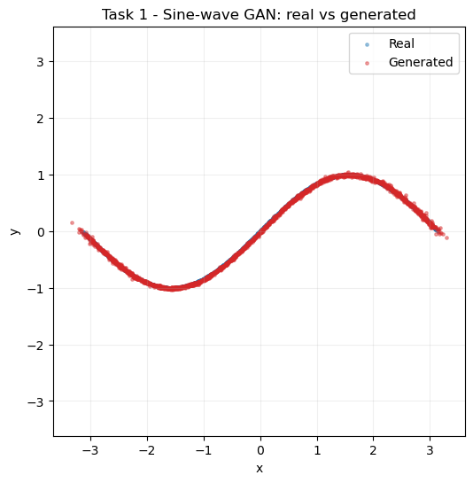

**Figure 1.** Real versus generated samples for the sine-wave GAN.

Figure 1 shows generated points lying along the true curve with only minor scatter near the turning points, where nonlinearity is greatest. The losses settle at equilibrium and hold — discriminator around 1.38, generator around 0.70 (final `D=1.3778`, `G=0.6964`). A discriminator loss near `2·ln(2) ≈ 1.386` signals a balanced game in which it can no longer separate real from fake, so the pipeline behaves as intended.

### Task 2 and Task 3: A new 2D distribution and an architecture change

For the new distribution I chose a **mixture of Gaussians**: eight isotropic modes on a ring of radius 2.0 with per-mode std 0.05, trained for 8,000 steps. A ring of well-separated modes is the standard probe for *mode collapse*, since a collapsed generator would cover only some of the eight blobs. Task 3 then changes only the network — from the 2×128 ReLU baseline to a deeper, wider 4×256 network with the self-normalising SELU activation (Klambauer et al., 2017), which keeps activations well-scaled in deeper stacks.

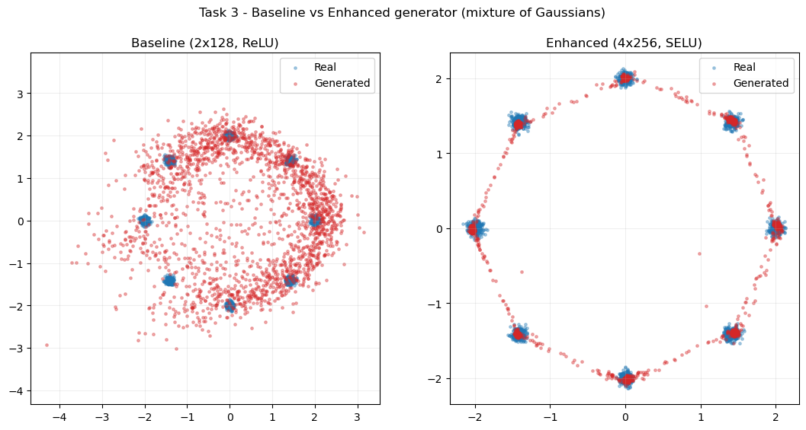

**Figure 2.** Architecture comparison on the mixture of Gaussians.

Figure 2 captures both tasks at once. The baseline (left) reaches all eight modes — *no hard mode collapse* — but the red cloud is loose, filling the gaps between blobs rather than sitting on the centres: the classic "covers the modes but not sharply" behaviour of a small vanilla GAN. The enhanced network (right) tightens the samples onto the mode centres and traces a clean ring. Losses stay stable in both cases (enhanced ends at `D=1.4444`, `G=0.8657`), so the extra depth, width and smoother activation buy *sample sharpness* rather than fixing a collapse that never occurred. The inference is that, for this target, capacity and activation control sharpness, not mode coverage.

## Part 2: Real-World GAN Applications

### Part 2.1: Optical coherence tomography (OCT) retinal images with MedMNIST

OCTMNIST is a MedMNIST subset of 28×28 grayscale retinal OCT scans in four diagnostic classes (Yang et al., 2023). I train a DCGAN, which suits images because it replaces dense layers with strided and transposed convolutions, adds BatchNorm and LeakyReLU/ReLU activations, and uses a weight-init recipe shown to stabilise image GANs (Radford et al., 2015). Images are worked at 32×32 (a clean power of two for the four conv stages) and scaled to `[-1, 1]` to match the generator's Tanh.

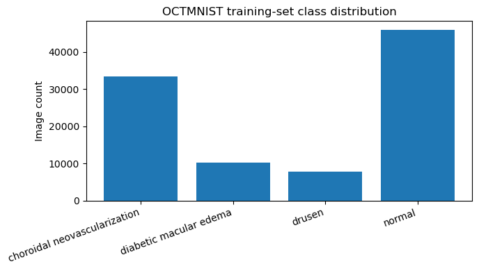

**Figure 3.** Class distribution of the OCTMNIST training split.

The data has four classes (choroidal neovascularization, diabetic macular edema, drusen, normal) and a training split of shape `(97477, 28, 28)`. Figure 3 shows a marked imbalance of roughly 6:1, which matters for the conditional extension: without correction the minority classes barely train. The unconditional DCGAN uses a random 40,000-image subset.

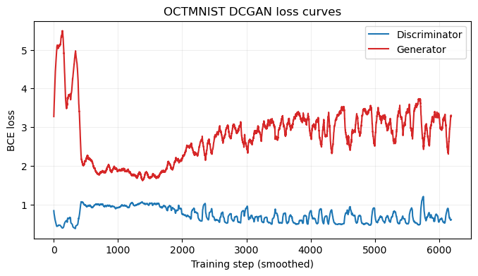

**Figure 4.** Generator/discriminator losses during OCTMNIST DCGAN training.

Figure 4 tracks 40 epochs. Training starts unbalanced (`D=0.39`, `G=5.35` at epoch 1), with the discriminator dominating, then moves into a closer back-and-forth (`D≈0.9–1.1`, `G≈1.3–2.6`) — the healthy shape of a DCGAN that is learning, not collapsing. The occasional spike (e.g. epoch 19, `D=3.16`) is normal adversarial oscillation, not divergence.

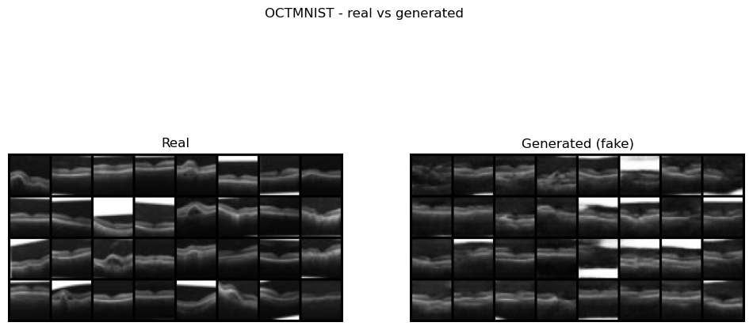

**Figure 5.** Real versus generated OCT scans, FID = 43.70.

Figure 5 compares real and generated scans, quantified with FID, which compares InceptionV3 feature statistics between the two sets (Heusel et al., 2017). The generator scores **FID = 43.70**. Visually the fakes capture the bright curved retinal band over a darker background and are varied rather than collapsed, but are softer with occasionally smeared sub-layers — consistent with a mid-40s FID at 32×32 after 40 epochs. I read the score as directional, since Inception was trained on natural RGB photos, not grayscale scans.

**Extension — conditional GAN.** To generate a chosen class on demand I built a conditional DCGAN (Mirza and Osindero, 2014), embedding the label and concatenating it with the latent vector for the generator while adding it as a discriminator input channel.

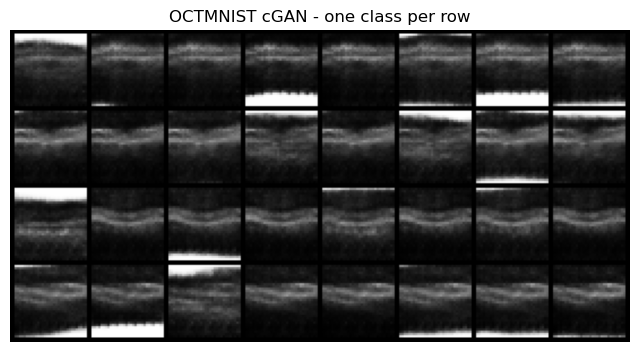

**Figure 6.** Class-conditional samples from the cGAN extension.

A naïve version collapsed (discriminator loss to zero, generator loss diverging, noise output). Three fixes stabilised it: one-sided label smoothing (real target 0.9) to curb discriminator over-confidence, a two time-scale update rule with a slower discriminator (Heusel et al., 2017), and class-balanced sampling for the 6:1 imbalance. Figure 6 shows samples generated per class on request, with losses recovering from `D=0.66`, `G=3.03` at epoch 1 into a stable range. The between-class differences stay subtle, reflecting how similar these scans look even in the real data.

**Reflection, and the "generating ducks" question.** The point behind the "ducks" prompt is that the DCGAN has no idea it is looking at eyes — it only learns the statistics of a pile of 32×32 arrays. Swap in duck photos and the identical code learns those instead. That content-agnosticism is why the same recipe transfers across Part 2, but it is also the key limitation: the discriminator learns *real versus fake*, never *anatomically plausible*, so it can render convincing structure with no anatomical basis. Synthetic scans are fine for augmentation or teaching but should not feed a real diagnostic pipeline without expert review.

### Part 2.2: Cybersecurity – Synthetic Traffic with CICIDS 2017

CICIDS 2017 stores each flow as roughly 78 numeric features rather than an image (Sharafaldin, Lashkari and Ghorbani, 2018). Because the data are tabular with no spatial locality, a convolutional DCGAN is inappropriate, so I use a **fully-connected GAN** that keeps the DCGAN *recipe* (adversarial `BCEWithLogitsLoss`, generator BatchNorm, a LeakyReLU discriminator with dropout, Adam, label smoothing) but uses dense layers and a linear output, since the standardised features are unbounded. Following the brief, I combine all per-day CSVs, then train on Wednesday.

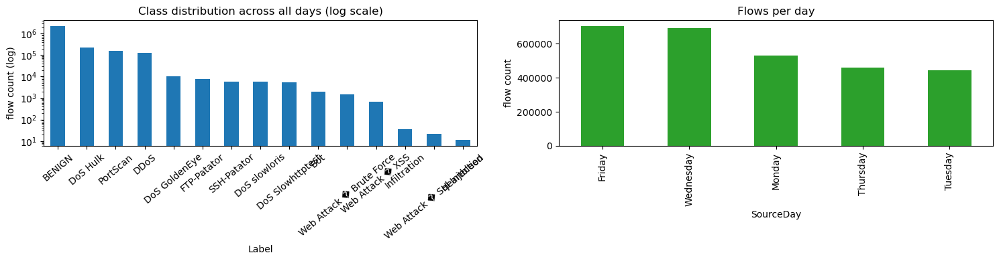

**Figure 7.** Combined CICIDS 2017 class balance and per-day volumes.

Merging the eight files gives **2,830,743 flows × 80 columns** with **78 numeric features**, needing 4,376 infinite and 1,358 missing values cleaned. Figure 7 shows BENIGN dominating so heavily that a log scale is needed to see the attacks — an imbalance that foreshadows later difficulty with rare attacks. A label note: the brief says "DDoS", but Wednesday contains single-source DoS attacks (Hulk, GoldenEye, slowloris, Slowhttptest), so I treat it as BENIGN vs DoS and flag the mismatch deliberately. Wednesday's largest labels are BENIGN = 440,031 and DoS Hulk = 231,073. Features are standardised and clipped to ±5σ so outliers cannot destabilise training; the GAN trains on a 20,000-row sample for 60 epochs (ending `D=1.0799`, `G=1.3983`).

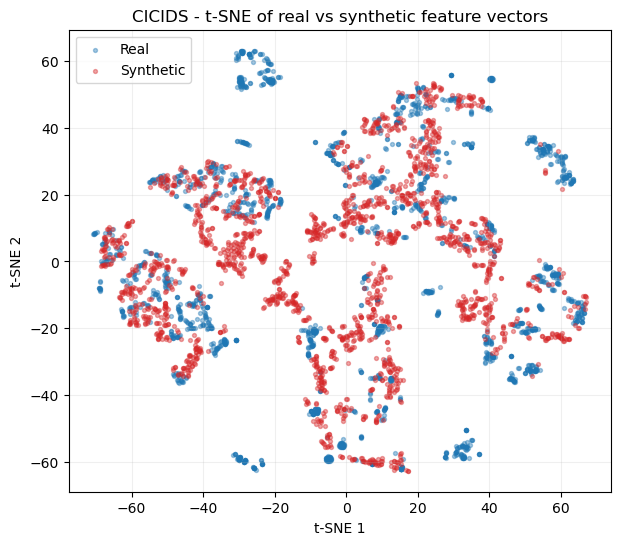

**Figure 8.** t-SNE of real versus synthetic Wednesday traffic.

Since a feature vector cannot be eyeballed, I evaluate alignment via PCA (linear) and t-SNE (nonlinear, local structure; van der Maaten and Hinton, 2008). Figure 8 shows the synthetic cloud sitting on the dense BENIGN region and pushing partway into the DoS clusters without reproducing their separate structure. Quantitatively, the average absolute per-feature gap (standardised) is **0.1057 on the means and 0.1975 on the standard deviations**. So the generator matches where most traffic lives and typical feature values, but is smoother than the real data and misses the DoS tails — the usual result for a plain unconditional GAN on heavy-tailed, partly-binary features.

**Extension — all days and generalisation.** Retraining on the full dataset (2,827,876 rows, 30,000 sampled) tests coverage across attack families.

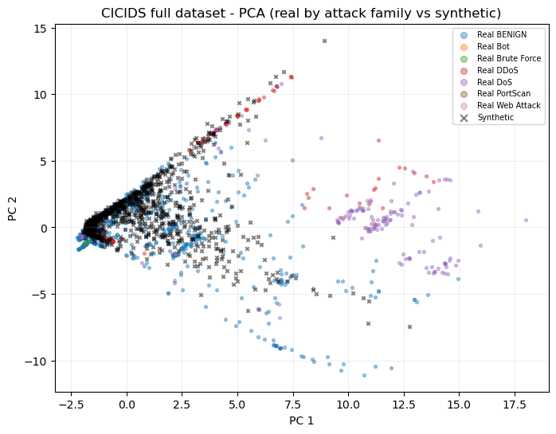

**Figure 9.** All-days PCA, real points coloured by attack family.

Figure 9 colours real points by family. The synthetic cloud leans to BENIGN and the large attack blobs while barely touching rare families — the comparison sample holds only 2 Bot, 11 Brute Force and 2 Web Attack real points, so there is almost nothing to learn from. Adding data slightly *improves* the mean-gap (0.1017 vs 0.1057) but *worsens* the std-gap (0.2762 vs 0.1975): more data sharpens averages but cannot cover the extra variance. A single unconditional GAN does not generalise across attack families; a conditional GAN or per-family models would follow. The "duck" point bites harder here — a synthetic flow can be statistically plausible yet physically impossible, which is why the overlap and per-feature-gap checks matter more than any visual inspection.

### Part 2.3: Creative AI – QuickDraw 'birthday cake' Subset

The final task trains a DCGAN on QuickDraw 'birthday cake' — 28×28 grayscale sketch bitmaps (Ha and Eck, 2018). I implement it in TensorFlow/Keras in the `model.fit` style: functional-API generator and discriminator wrapped in a `keras.Model` subclass whose `train_step` performs the adversarial update, deliberately showing a different framework and style from earlier parts. The config is a 100-d latent vector, 48 base feature maps, Adam at `lr = 0.00015` (`β₁ = 0.5`) and 35 epochs at batch 256; the generator has 677,952 parameters. Of 144,982 available sketches I train on a random 30,000.

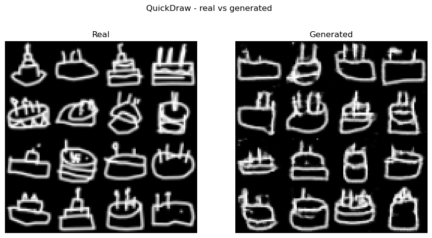

**Figure 10.** Real versus generated birthday-cake sketches, FID = 41.32.

Figure 10 compares real and generated cakes; the model scores **FID = 41.32** using the same InceptionV3 approach as Part 2.1. The cakes are clearly recognisable — a rounded or rectangular body, candles, often a plate — with line-art faults (broken strokes, speckle) visible up close but not hiding the subject. Losses stay in a healthy back-and-forth (from `d_loss=0.55`, `g_loss=2.84` at epoch 1), with only occasional spikes.

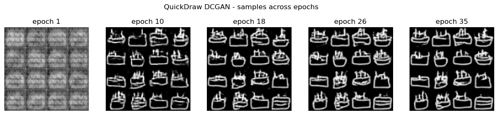

**Figure 11.** Sample progression across training epochs.

Figure 11 shows fixed-noise samples at five epochs. Early snapshots are blurry blobs; later ones sharpen into cake outlines with candles — the qualitative counterpart to the losses stabilising. Tracking the same noise over time separates genuine learning from mode-hopping: the samples evolve smoothly toward structure rather than jumping between shapes.

**Extension — other categories and complexity.** I retrained the same model on two more categories and compared FID against an "ink fraction" complexity proxy.

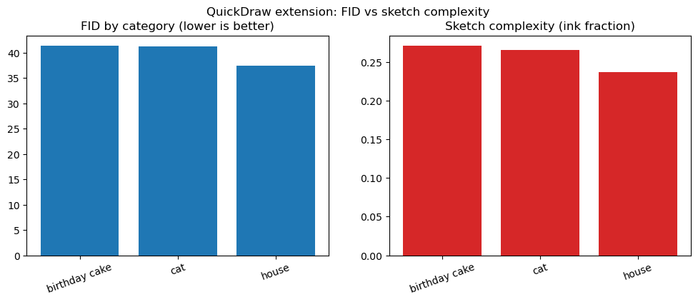

**Figure 12.** Cross-category FID versus ink-fraction complexity proxy.

Figure 12 reports **house = 37.39, cat = 41.22, cake = 41.32**, while ink-fractions are nearly flat (0.2368, 0.2655, 0.2708). Since ink density barely varies, it cannot explain the FID differences. House is easiest, fitting intuition — houses are structurally rigid, whereas cats and cakes vary more in pose, tiers and candle count. So *shape variety*, not ink coverage, drives difficulty; the cat–cake gap (0.10 FID) is small enough to sit within run-to-run noise, so I would not read it as a firm ranking.

## Conclusions and Future Work

The same adversarial recipe adapted cleanly to very different data by changing only the input representation and network family. Part 1 confirmed the mechanics: an MLP learned a sine wave almost perfectly and reached every mode of a Gaussian ring, and adding depth/width with SELU sharpened samples without altering coverage. Part 2.1 produced plausible OCT scans (FID 43.70) and a stabilised conditional model that generates any class on demand. Part 2.2 matched the bulk of real traffic (gaps 0.1057/0.1975 on Wednesday) but missed attack tails, with the all-days run confirming one unconditional model cannot span many families. Part 2.3 generated recognisable cake sketches (FID 41.32) and showed difficulty tracks shape variety, not ink density.

Three directions follow. First, **coverage of rare classes**: both the OCT imbalance and CICIDS rare-attack failure point to conditional generation, per-class models or minority-aware sampling. Second, **better-matched evaluation**: ImageNet-based FID is only directional for grayscale scans and line-art, so a domain-specific extractor or a "train-on-synthetic, test-on-real" classifier would give a more trustworthy signal. Third, **stronger objectives**: a Wasserstein loss with gradient penalty (Gulrajani et al., 2017) would likely tighten the loose Gaussian-mixture and smoothed CICIDS distributions. The recurring lesson, framed by the "duck" question, is that a GAN learns *statistical* resemblance, never *semantic correctness*, so synthetic medical or security data must be validated before it is trusted downstream.

## References

Goodfellow, I. et al. (2014) 'Generative adversarial nets', in *Advances in Neural Information Processing Systems (NeurIPS) 27*. Montreal, pp. 2672–2680.

Gulrajani, I. et al. (2017) 'Improved training of Wasserstein GANs', in *Advances in Neural Information Processing Systems (NeurIPS) 30*. Long Beach, CA, pp. 5767–5777.

Ha, D. and Eck, D. (2018) 'A neural representation of sketch drawings', in *International Conference on Learning Representations (ICLR)*. Vancouver.

Heusel, M. et al. (2017) 'GANs trained by a two time-scale update rule converge to a local Nash equilibrium', in *Advances in Neural Information Processing Systems (NeurIPS) 30*. Long Beach, CA, pp. 6626–6637.

Klambauer, G. et al. (2017) 'Self-normalizing neural networks', in *Advances in Neural Information Processing Systems (NeurIPS) 30*. Long Beach, CA, pp. 971–980.

Mirza, M. and Osindero, S. (2014) 'Conditional generative adversarial nets', *arXiv preprint* arXiv:1411.1784.

Radford, A., Metz, L. and Chintala, S. (2015) 'Unsupervised representation learning with deep convolutional generative adversarial networks', *arXiv preprint* arXiv:1511.06434.

Sharafaldin, I., Lashkari, A.H. and Ghorbani, A.A. (2018) 'Toward generating a new intrusion detection dataset and intrusion traffic characterization', in *Proceedings of the 4th International Conference on Information Systems Security and Privacy (ICISSP)*. Funchal, pp. 108–116.

van der Maaten, L. and Hinton, G. (2008) 'Visualizing data using t-SNE', *Journal of Machine Learning Research*, 9, pp. 2579–2605.

Yang, J. et al. (2023) 'MedMNIST v2 — a large-scale lightweight benchmark for 2D and 3D biomedical image classification', *Scientific Data*, 10(1), 41.
